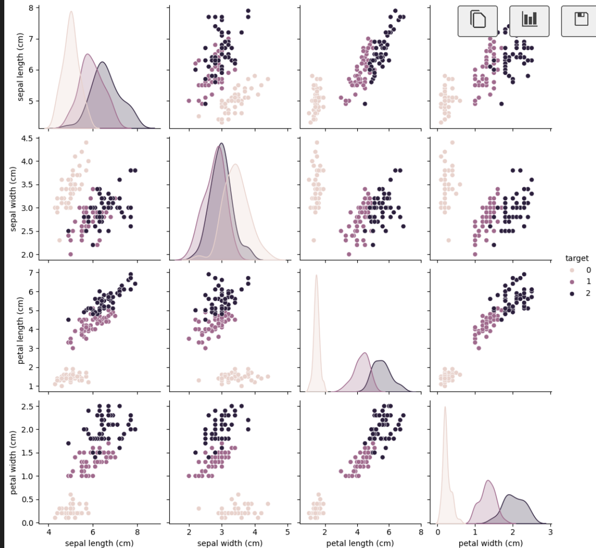

# Data Analysis Template (Offline-Ready)

This repository provides a Jupyter Notebook template for quick and professional data analysis using Python.  
It works **offline** by leveraging built-in datasets (e.g., Iris) from scikit-learn.

---

## Features
- Quick data loading (no internet required)
- Data exploration & summary
- Clean visualization templates
- Ready-to-use workflow for beginners and professionals

---

## Sample Output


---

## Installation
```bash
python -m venv .venv
source .venv/bin/activate   # macOS/Linux
# .venv\Scripts\activate    # Windows
pip install -r requirements.txt


Author
Your Dhimy Jeahj
Date: 2025-08-04

